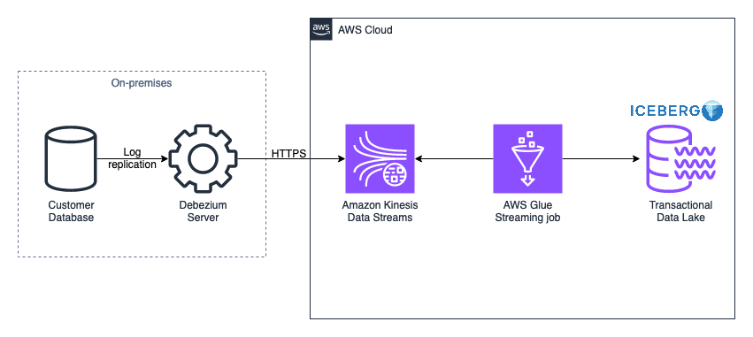
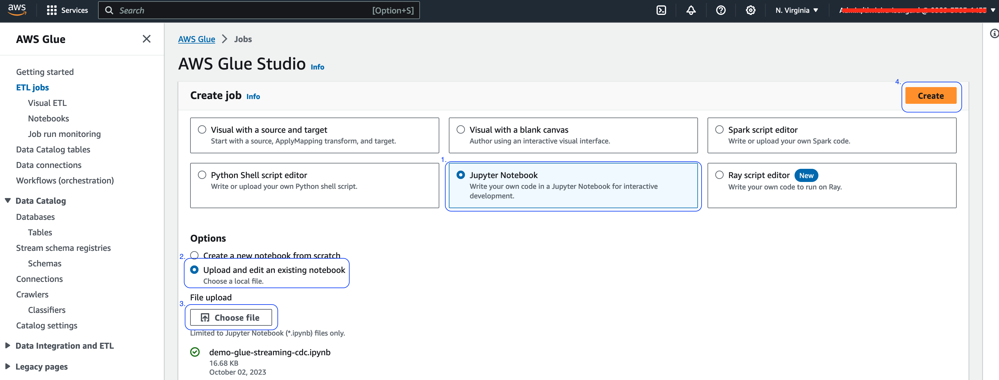
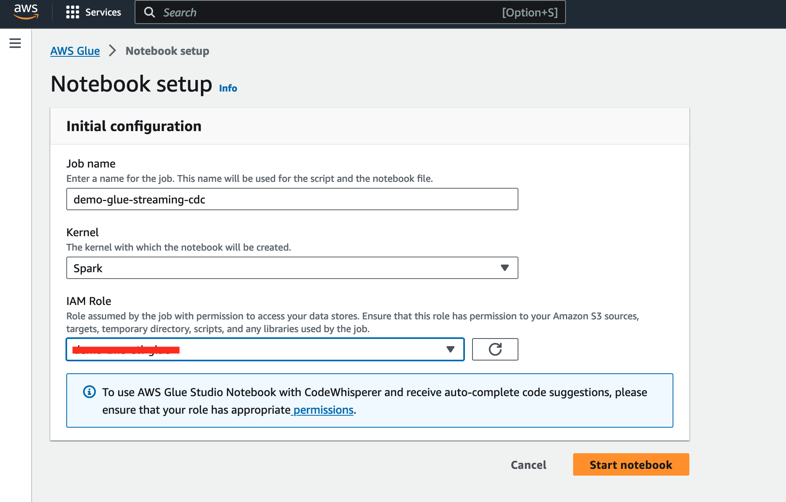
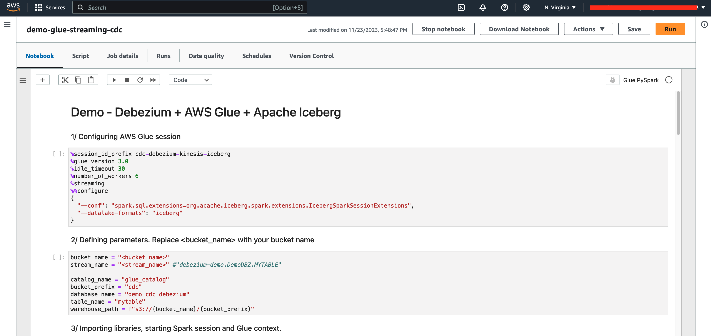

# Build a real-time incremental data load solution using open-source Debezium, Apache Iceberg and AWS Glue streaming



This repository provides an [AWS Glue Studio notebook](https://docs.aws.amazon.com/glue/latest/dg/notebooks-chapter.html) that builds a sample pipeline that loads real time data changes into a transactional data lake with CDC (Change Data Capture) approach. 


## Use Agreement

We recommend that you use this notebook as a starting point for creating your own, not for launching production-level environments. Before launching, always review the resources and policies that it will create and the permissions it requires. Using this code `I Agree` I'm solely responsible for any security issue caused due any misconfiguration and/or bugs. 

## Instructions

### Creating the table for replication

Before starting, it is important to note that the installation and configuration of the source database and the deployment and configuration of the Debezium Server are outside the scope of this project, so it is assumed as a prerequisite that you are prepared to replicate a new table via Amazon Kinesis.

1. Create `MYTABLE` table with the columns `DATA_ID` (INTEGER, Primary Key), `DATA` (VARCHAR (50)) and insert some records. Below is the code to create the table in MySQL engine, however Debezium works with other database engines, you can read more about it [here](https://debezium.io/documentation/reference/2.5/connectors/index.html).

```
CREATE TABLE MYTABLE (
    DATA_ID INTEGER PRIMARY KEY,
    DATA VARCHAR(50)
);

INSERT INTO MYTABLE VALUES (1,'data1'),(2,'data2');
```
**Note**: After create the table, it is necessary to configure properly the Debezium configuraion file (application.properties) and start Debezium Server service to stream data.

### Creating AWS Glue Studio notebook


1. Clone the repository or download the [AWS Glue Studio Notebook](demo-cdc-glue-streaming.ipynb) file to your computer.
<br>

2. Access the AWS Glue Studio console from your account. Click on `ETL jobs` in the menu on the left, under `Create job` select `Jupyter Notebook` (1) and `Upload and edit an existing notebook` (2). Click the `Choose file` button (3) and select the `demo-cdc-glue-streaming.ipynb` file. To complete the creation, click “Create” (4).



3. Add a name for the Job, select the Spark option as Kernel, and select an IAM Role with [AWS Glue services](https://docs.aws.amazon.com/glue/latest/dg/configure-iam-for-glue.html) permissions and also to read from [Kinesis stream](https://docs.aws.amazon.com/glue/latest/dg/aws-glue-programming-etl-connect-kinesis-home.html#aws-glue-programming-etl-connect-kinesis-read). After that click on `Start notebook`.



4. The notebook contains 21 steps, starting configuring AWS Glue parameters, importing libraries, running the CDC and ending stopping the session. Attention to item `2/` which requires replacing `<bucket_name>` and `<stream_name>` values and item `9/` which is optional to filter streaming by a date range.



**Note**: For a better understanding of the code, perform one step at a time and read the results before perform next step.

## Security

See [CONTRIBUTING](CONTRIBUTING.md#security-issue-notifications) for more information.

## License

This library is licensed under the MIT-0 License. See the LICENSE file.